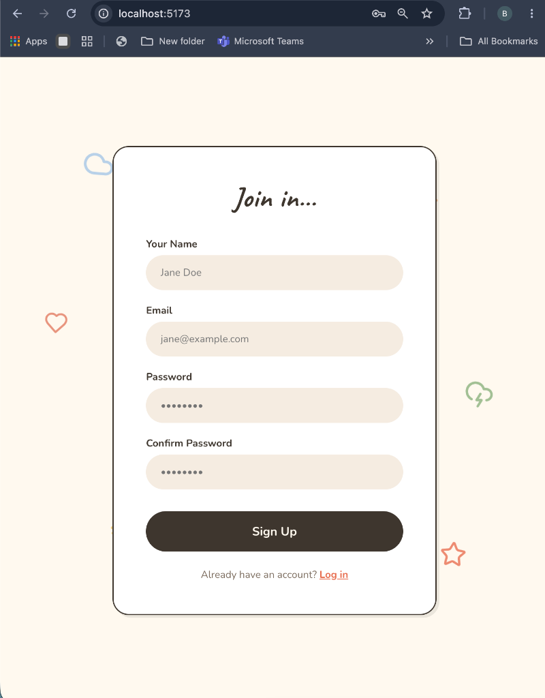

# PrimetradeAI Internship Assignment

This repository contains a secure, scalable REST API for a Task Management System, along with a complementary responsive frontend UI to demonstrate the API's capabilities. 

## Features

Backend:
- User registration and login using JWT and bcrypt password hashing.
- Role-based access control (User vs Admin).
- Complete CRUD operations for task management.
- Data validation using Zod and global error handling.
- Redis caching to reduce database load.
- API documentation using Swagger.

Frontend:
- Built with React and Vite.
- Secure login and registration forms.
- Protected dashboard to view and manage tasks based on user role.

## 📸 UI Showcase

**1. Registration Flow**


**2. User Dashboard**


**3. Admin Dashboard (Role-Based Access)**


## 💻 Command Line (API Testing)

You can easily test the APIs from your terminal using `curl`:

**Register a new user:**
```bash
curl -X POST http://localhost:5001/api/v1/auth/register \
  -H "Content-Type: application/json" \
  -d '{"name": "Test User", "email": "test@example.com", "password": "password123"}'
```

**Fetch tasks (Requires JWT):**
```bash
curl -X GET http://localhost:5001/api/v1/tasks \
  -H "Authorization: Bearer YOUR_TOKEN_HERE"
```

## Tech Stack

- Backend: Node.js, Express, TypeScript, Prisma ORM
- Database & Cache: PostgreSQL, Redis
- Frontend: React.js, Vite
- Deployment: Docker Compose

## Local Setup

1. Start the database and cache using Docker:
   ```bash
   docker-compose up -d
   ```

2. Setup the backend:
   ```bash
   cd backend
   npm install
   npx prisma db push
   npm run dev
   ```

3. Setup the frontend:
   ```bash
   cd frontend
   npm install
   npm run dev
   ```

The frontend will run on http://localhost:5173 and the backend API on http://localhost:5001.

## API Documentation

Once the backend is running, you can view the Swagger API documentation at http://localhost:5001/api-docs.

## Scalability Note

The system is designed to scale easily:
- Redis Caching: Used for read-heavy operations like fetching task lists to minimize direct database hits.
- Stateless Auth: JWTs are used for authentication, meaning the backend does not rely on server-side sessions, allowing for easy horizontal scaling.
- Modular Architecture: Controllers, services, and routes are cleanly separated, making it straightforward to split features into microservices later if needed.
